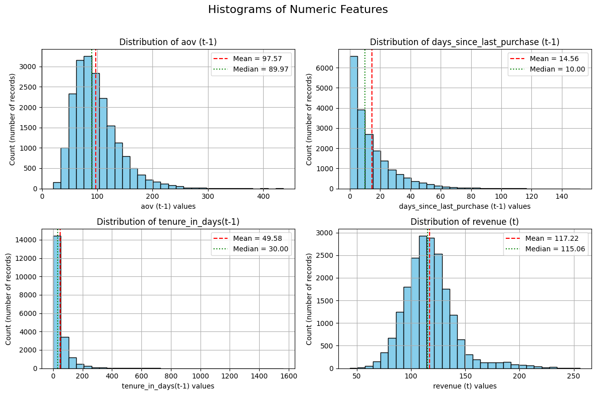
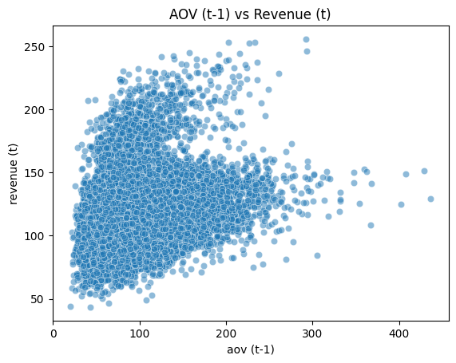
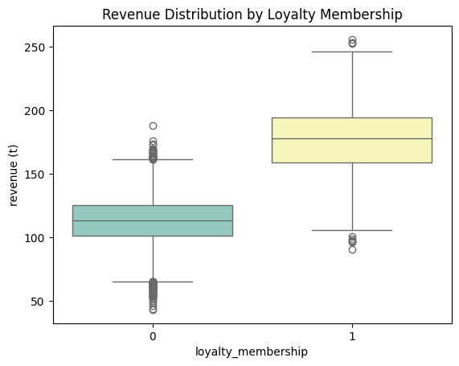
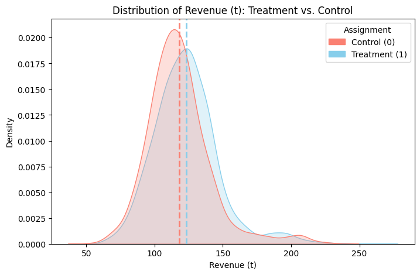
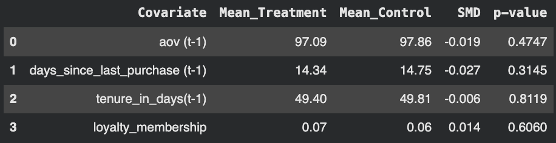
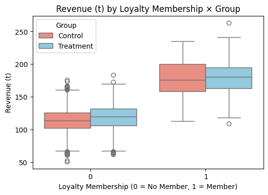

# Unwrapping Customer Delight: Optimizing Surprise Gift Strategies

---

### 👥 **Team Members**

| Name             | GitHub Handle | Contribution                                                             |
|------------------|---------------|--------------------------------------------------------------------------|
| [Name]           | @[handle]     | [Contribution description]                                               |
| Ava Leung        | @Ava-Leung    | Pre-experiment data analysis, power analysis, presentations              |
| Nidhi Parvathala | @nidhiparvathala5 | Pre-experiment, MLRATE, Experiment data analysis      |
| Sandy Wu         | @sandywu198   | MLRATE implementation, experiment data analysis, power analysis          |
| Sehr Abrar       | @sehr_abrar   | Power analysis, estimating standard ATE, MLRATE implementation           | 
| Charitha Sarraju | @charithasj   | Pre-experiment, MLRATE, presentation                                     | 
| Xiaoyan Li       | @FreshTaurus   | EDA on Experiment Data,MLRATE implementation,presentations,           |
| Lydia Aubourg    | @lydaub  | EDA on pre-experiment and experiment data, Estimating Standard ATE, Presentations|

---

## 🎯 **Project Highlights**

- Analyzed the causal impact of surprise gifts on customer spending using Randomized Controlled Trials (RCTs)
- Implemented the Machine Learning Regression-Adjusted Treatment Effect (MLRATE) technique for treatment effect estimation
- Generated actionable insights to optimize marketing strategies and enhance customer loyalty for Estée Lauder
- Conducted comprehensive power analysis and EDA to inform experimental design and data-driven decision making

---

## 👩🏽‍💻 **Setup and Installation**

### Prerequisites
- Python 3.8+
- Jupyter Notebook or JupyterLab

### Installation Steps

1. **Clone the repository**
   ```bash
   git clone https://github.com/sehr-abrar/estee-lauder-1b.git
   cd estee-lauder-1b
   ```

2. **Install dependencies**
   ```bash
   pip install -r requirements.txt
   ```
   - These are some of the dependencies used:
   - pandas
   - numpy
   - seaborn
   - matplotlib
   - statsmodels
   - scikit-learn

3. **Access the datasets**
   - Datasets are located in the `data/` folder:
     - `experiment_results_1b.parquet` — Experiment results data
     - `pre_experiment_data.parquet` — Pre-experiment baseline data

4. **Run the notebooks**
   ```bash
   jupyter notebook
   ```
   - Navigate to the `notebooks/` folder and open the desired notebook

---

## 🏗️ **Project Overview**

This project is part of the **Break Through Tech AI Program** in collaboration with **Estée Lauder** as our host company.

**Objective:** Evaluate the causal effect of surprise gifts on customer purchasing behavior and provide data-driven recommendations for optimizing gift strategies in marketing campaigns.

**Real-world Significance:** Understanding the true impact of promotional gifts on customer spending helps companies allocate marketing budgets more effectively, enhance customer experiences, and build long-term loyalty. This project demonstrates how causal inference techniques combined with machine learning can provide robust estimates of treatment effects beyond traditional A/B testing approaches.

---

## 📊 **Data Exploration**

### Datasets
- **experiment_results_1b.parquet**: Contains experimental data including treatment assignments, customer spending, and relevant features
- **pre_experiment_data.parquet**: Pre-experiment customer data used for baseline analysis and covariate selection

### Data Exploration Process
- Conducted comprehensive Exploratory Data Analysis (EDA) on both pre-experiment and experiment data
- Analyzed customer demographics, purchasing patterns, and treatment group distributions
- Identified key covariates and potential confounders for treatment effect estimation

## EDA Findings
### Pre-Experiment Data
- **Spending Is Skewed**: Most customers have low or near-zero past AOV, while a small group of high spenders drives a disproportionate share of revenue.
- **Past AOV Predicts Revenue**: Higher average order value in the previous period is strongly associated with higher current revenue, making AOV a key predictive feature.
- **Tenure Is Weakly Related to Revenue**: Customer tenure alone does not strongly predict revenue; long-term customers can still be low-value or inactive.
- **Loyalty Members Generate More Revenue**: Loyalty program members have substantially higher median and average revenue than non-members, indicating higher customer value.
- **Recency Matters**: Customers who purchased more recently tend to be more valuable, while inactive customers present re-engagement opportunities.
### Annotated Visualizations

**Distribution of Numeric Features**

*Histograms of AOV, days since last purchase, tenure, and revenue show skewed distributions with long tails. Mean and median lines highlight the presence of high-value customers.*

**AOV (t-1) vs Revenue (t)**

*Higher past average order value is strongly associated with higher current revenue, indicating AOV is a key predictive feature.*

**Revenue by Loyalty Membership**

*Loyalty members consistently generate higher revenue than non-members, with a higher median and upper quartile.*


### EDA Findings (Experiment Data)
- **Data Quality & Integrity**: The experiment dataset contains 5,556 observations with no missing values or duplicates. All variables have appropriate data types, confirming the dataset is clean and suitable for analysis.
- **Numeric Distributions Are Right-Skewed**: Revenue, AOV, tenure, and recency exhibit right-skewed distributions with long tails. Most customers cluster at lower values, while a small group of high-value customers drives higher means.
- **Outliers Reflect Real Customer Behavior**: IQR-based outlier analysis shows that outliers are primarily high-spending, long-tenured, or infrequently purchasing customers. These points represent valid behavior and were retained for analysis.
- **Successful Randomization (Covariate Balance)**: Treatment and control groups are well balanced across all pre-treatment covariates (AOV, recency, tenure, loyalty), with standardized mean differences below 0.03 and non-significant p-values. This confirms valid random assignment.
- **Positive Treatment Effect on Revenue**: Visual and statistical comparisons show that the treatment group has higher average revenue than the control group. A Welch’s t-test confirms this difference is statistically significant (p < 0.001).
- **Treatment Effects Are Modest but Consistent**: Revenue distributions for treatment and control overlap substantially, indicating a modest effect size despite statistical significance.
- **Revenue Drivers Remain Consistent Across Groups**: Revenue increases with past AOV and decreases with time since last purchase for both groups, suggesting the treatment did not fundamentally alter customer spending patterns.
- **Heterogeneous Effects by Loyalty Status**: Loyalty members generate substantially higher revenue overall, and the treatment effect appears slightly stronger among loyalty members compared to non-members.

**Revenue Distribution by Treatment Assignment**  
  
*The treatment group shows a modest rightward shift in revenue compared to control, indicating a positive treatment effect.*

**Covariate Balance Diagnostics**  
  
*Standardized mean differences near zero confirm strong balance between treatment and control groups.*

**Revenue by Loyalty Membership × Assignment**  
  
*Loyalty members generate higher revenue overall, with a slightly stronger treatment effect among members.*

### Notebooks
- `EDA_pre_experiment.ipynb` — Analysis of pre-experiment data
- `EDA_experiment.ipynb` — Analysis of experiment results
- `power_analysis.ipynb` — Statistical power calculations for experimental design

---

## 🧠 **Model Development**

### Approach
- **Causal Inference Framework**: Randomized Controlled Trial (RCT) design
- **Treatment Effect Estimation**: Machine Learning Regression-Adjusted Treatment Effect (MLRATE)
- **Standard ATE**: Traditional Average Treatment Effect estimation for comparison

### Methodology
- Implemented MLRATE to improve precision of treatment effect estimates by adjusting for covariates
- Compared standard ATE with ML-adjusted estimates to demonstrate efficiency gains
- Conducted power analysis to determine sample size requirements and detect meaningful effects

### Notebooks
- `estimating_standard_ATE.ipynb` — Standard treatment effect estimation
- `estimating_standard_ATE_Updated.ipynb` — Updated analysis incorporating refinements
- `power_analysis.ipynb` — Power calculations and sample size determination

---


## 📈 **Results & Key Findings**

### Performance Metrics
- [Treatment effect estimates to be filled]
- [Confidence intervals and statistical significance to be filled]
- [Comparison of standard vs. ML-adjusted estimates to be filled]

### Key Insights
- [Impact of surprise gifts on customer spending to be filled]
- [Heterogeneous treatment effects across customer segments to be filled]
- [Recommendations for gift strategy optimization to be filled]

### Visualizations
- Treatment effect plots
- Covariate balance checks
- Distribution of outcomes by treatment group
- Power analysis curves

---

## 🚀 **Next Steps**

### Potential Improvements
- Explore heterogeneous treatment effects across different customer segments (e.g., by purchase history, demographics)
- Implement additional machine learning models for treatment effect estimation (e.g., causal forests, meta-learners)
- Conduct sensitivity analyses to assess robustness of findings
- Develop a recommendation system for personalized gift strategies

### With More Resources
- Analyze longer-term effects on customer lifetime value and retention
- Incorporate additional data sources (e.g., website behavior, customer satisfaction surveys)
- Build a real-time decision system for gift allocation

---

## 📝 **License**

This project is licensed under the MIT License. See the [LICENSE](LICENSE) file for details.

---

## 📄 **References**

1. Chernozhukov, V., et al. (2018). "Double/debiased machine learning for treatment and structural parameters." The Econometrics Journal.
2. Imbens, G. W., & Rubin, D. B. (2015). "Causal Inference for Statistics, Social, and Biomedical Sciences: An Introduction."
3. Additional references from project notebooks and analysis

---

## 🙏 **Acknowledgements**

We would like to thank:
- Our Challenge Advisors for their guidance and support throughout the project
- Estée Lauder representatives for providing the business context and data
- Break Through Tech AI Program staff and TAs for their assistance
- Cornell Tech for hosting the AI Studio program
